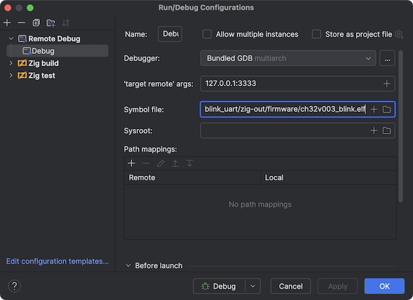

# ch32v003 from scratch in Zig

Examples range from simple to complex. Everything is compiled with a simple `zig build`. \
The [minichlink](tools/minichlink) flasher is also included and can be
compiled using `zig build` as well.

## Getting Started

> \[!NOTE\]
> If you are using `nix`, you can simply run `nix develop` in the root of the project, and it will automatically install
> `zig`, `zigscient`, and `minichlink` in your environment.
> And you can skip to the [Build and upload the example](#build-and-upload-the-example) section.

### Install Zig

Currently, the examples are tested with `0.14.0-dev.3328`.\
You can download the latest version from:
https://ziglang.org/download/

### Build the flasher

```shell
cd tools/minichlink
zig build --release=safe

# Add the `minichlink` to your `PATH`:
export PATH=$PATH:$(pwd)/zig-out/bin
```

### Build and upload the example

```shell
cd 001_blink_minimal
zig build
minichlink -w zig-out/firmware/ch32v003_blink.bin flash -b
```

## Useful Notes

### Flashing

```shell
# Write and reboot.
minichlink -w zig-out/firmware/ch32v003_blink.bin flash -b
```

### Debugging

```shell
# Run GDB server.
minichlink -G
# Reboot into halt and run GDB server 
# (firmware will be halted until GDB is connected).
minichlink -a -G
```

In `CLion`: add a new `Remote Debug` configuration.



### Show firmware info

```shell
# Size (clang)
size zig-out/firmware/ch32v003_blink.elf
# Sections info (clang)
objdump -h zig-out/firmware/ch32v003_blink.elf 
bloaty zig-out/firmware/ch32v003_blink.elf
```

### Dump memory

```shell
minichlink -r memory.bin 0x20000000 2048
```

### UART

```shell
screen /dev/tty.usbmodem* 115200 
```

`Ctrl + A`, `Ctrl + \` - Exit screen and terminate all programs in this screen. \
`Ctrl + D`, `D` or `Ctrl + A`, `Ctrl + D` - "minimize" screen and `screen -r` to restore it.
