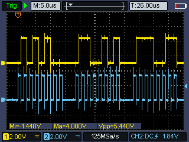
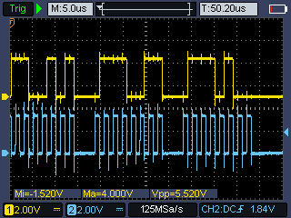

```shell
zig build
# upload
minichlink -w zig-out/firmware/ch32v003_blink.bin flash -b
```

| Byte | Char  | Binary     | HEX    |
|------|-------|------------|--------|
| 1    | `'T'` | `01010100` | `0x54` |
| 2    | `'e'` | `01100101` | `0x65` |
| 3    | `'s'` | `01110011` | `0x73` |
| 4    | `'t'` | `01110100` | `0x74` |

 
